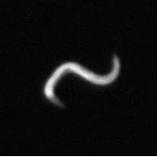
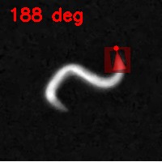
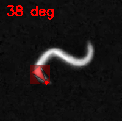

# Worm Head-Tail Detection for C. elegans

A computer vision system for detecting head and tail endpoints in C. elegans worms using directional template matching.

## Installation

### Prerequisites
- Python 3.12+
- Conda or Miniconda

### Setup Environment

1. Clone the repository:
```bash
git clone <repository-url>
cd worm-head-tail-detection
```

2. Create conda environment from the provided environment file:
```bash
conda env create -f environment.yml
```

3. Activate the environment:
```bash
conda activate head_tail
```

### Verify Installation
```bash
python -c "import cv2, numpy, pandas, matplotlib, seaborn, skimage; print('All dependencies installed successfully!')"
```

## Project Structure

```
worm-head-tail-detection/
├── 1_convolution_method/          # Template matching approach
│   ├── run.py                     # Main detection script
│   ├── simple_convolution.py     # Basic convolution implementation
│   ├── comparisons/               # Analysis and comparison tools
│   │   ├── output comparisons.py # Performance analysis script
│   │   ├── datasets/              # Ground truth and result datasets
│   │   └── outputs/               # Analysis results and plots
│   └── outputs/                   # Detection results and visualizations
├── 2_vesselness_filters/          # Vesselness filter approach (not used in the project)
│   └── run.py                     # Vesselness-based detection (not used in the project)
├── utils/                         # Utility scripts
└── environment.yml                # Conda environment specification
```

## Usage

### 1. Convolution Method

The main detection script uses directional template matching with triangular kernels.

#### Single Image Processing
```bash
cd 1_convolution_method
python run.py --input path/to/image.png
```

#### Batch Processing
```bash
python run.py --folder path/to/images/folder --output_base outputs/batch_results
```

#### Custom Parameters
```bash
python run.py \
    --input path/to/image.png \
    --length 26 \
    --width 18 \
    --blur 3 \
    --neg_cap 0.4 \
    --angle_step 1 \
    --output_base outputs/custom_run
```

**Parameters:**
- `--input`: Path to input image (default: frames_001000_001600/001547_0.png)
- `--folder`: Process all PNG files in specified folder
- `--output_base`: Output directory (default: outputs/kernel_only)
- `--length`: Kernel length in pixels (default: 26)
- `--width`: Kernel width in pixels (default: 18)
- `--blur`: Gaussian blur kernel size (default: 3)
- `--neg_cap`: Negative cap strength 0-1 (default: 0.4)
- `--angle_step`: Rotation angle step in degrees (default: 1)

#### Output Files
- `detected_tips.png` - Original image with detected endpoints
- `kernel.png` - Visualization of the detection kernel
- `skeleton.png` - Skeletonized binary mask
- `search_windows.png` - Seed points and search regions
- `tip_1_kernel_overlay.png` - Kernel overlay for tip 1
- `tip_2_kernel_overlay.png` - Kernel overlay for tip 2
- `detection_results.csv` - Endpoint coordinates (batch mode)

#### Sample Results

**Input Image:**


**Detection Output with Kernel Overlays:**

*Tip 1 Detection (188°):*


*Tip 2 Detection (39°):*

